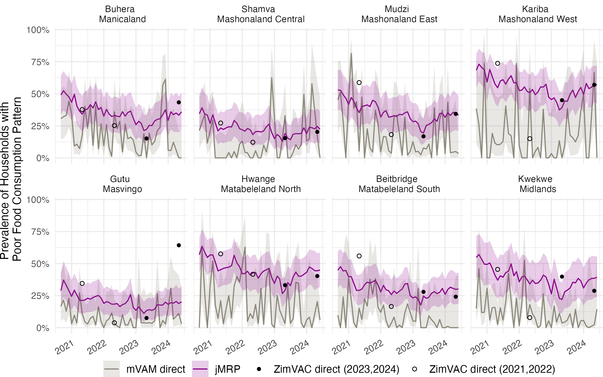

# Realtime-SAE-Zimbabwe
This is a repository for the work "Real-time small area estimation of Food security in Zimbabwe: integrating mobile-phone and face-to-face surveys using joint multilevel regression and poststratification." ([arXiv](https://arxiv.org/pdf/2505.03517)).



## Structure of the repository
The repo should have a `data` folder and a sub-folder `raw` with the following datasets: 
* Mobile-phone data: In our analysis, WFP's mVAM survey for Zimbabwe conducted within [Real-time Monitoring system](https://executiveboard.wfp.org/document_download/WFP-135070)
* Face-to-face data: In our data analysis, this is The Rural Zimbabwe Vulnerability Assessment Committee (ZimVAC) survey. See [Food and Nutrition Council Zimbabwe](https://www.fnc.org.zw/documents/) for the related reports. We used Household-level data (2023 survey for modelling, 2024 survey for validation).The aggregated data (2021 and 2022 survey) are used only for reference. 

Both data should have the same structure, e.g. 

| household_id | adm1_name| adm2_name | obs_month | fcs | covariate_1 | covariate_2| $\dots$ |
| -----------: | --------:| --------: | -----: | ----------: | ----------:| ------: |------: |
| 1 | Matabeleland South  | Beitbridge | 2023-05-01 |     40     | A | B |

In addition, we will also need
* Data from the 2015 Zimbabwe DHS survey which can be can be requested [here](https://dhsprogram.com/Countries/Country-Main.cfm?ctry_id=48&c=Zimbabwe). 
* Zimbabwe MICS6 SPSS Datasets. This can be requested and downloaded from [here](https://mics.unicef.org/surveys).
* Nigeria's shapefile: `Zimbabwe_adm2_uscb_2022.shp` can be downloaded from [here]( https://www2.census.gov/programs-surveys/international-programs/mapping-files/time-series/zimbabwe-adm1-adm2-uscb-feb22.zip). This is modified so that the `adm2_name` matches those from mVAM surveys, and saved to `processed` as `shapefile.rds`
* Zimbabwe 2022 census: `n_hh_by_district_and_ward.xlsx` should contain information extracted from section 5 of [the report](https://zimbabwe.unfpa.org/en/publications/2022-population-and-housing-census-preliminary-results/). 

The data should be organized in the following tree structure:
```
 ├── data
 |  ├── raw
 |  │   ├── mVAM
 |  |   |   ├── WFP_mvam_weights_pop.xlsx
 |  |   |   └── mVAM.csv                                
 |  │   ├── ZimVAC 
 |  |   |   ├── zimvac2024_survey.csv.
 |  |   |   ├── zimvac2023_survey.csv
 |  |   |   ├── zimvac2022_agg.csv
 |  |   |   └── zimvac2021_agg.csv
 |  │   ├── zimbabwe-adm1-adm2-uscb-feb22
 |  │   |   ├── Zimbabwe_adm2_uscb_2022.shp
 |  │   |   ├── ...
 |  │   |   └── ...
 |  │   ├── MICS6
 |  │   |   ├── hh.sav
 |  │   |   ├── hl.sav
 |  │   |   └── ...
 |  │   ├── DHS
 |  │   |   ├── ZWGE72FL
 |  │   |   |   ├── ZWGE72FL.shp
 |  │   |   |   ├── ...
 |  │   |   |   └── ...
 |  │   |   └── ZWFW71FL.SAV
 |  |   ├── adm2_matched.csv
 |  |   └── n_hh_by_district_and_ward.xlsx
 |  └── processed - shapefile.rds
```


